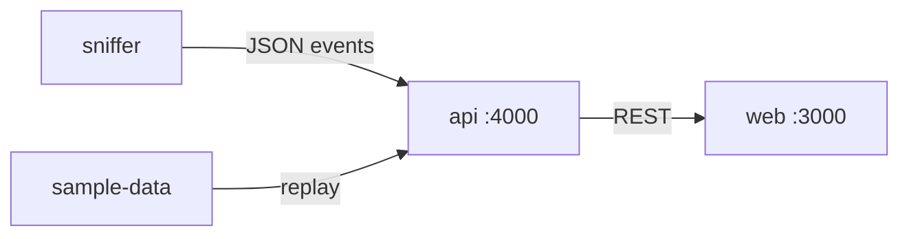

# Outbounds

**See who your device is really talking to.**

Local network visibility for outbound destinations, DNS failures, latency issues, and unexpected connections.  
**Metadata only** — no TLS decryption.

## Architecture

```text
sniffer ──events──► api (:4000) ──REST──► web (:3000)
                      ▲
                 sample-data (replay)
```

| Service | Role |
|---|---|
| `web/` | Next.js product UI |
| `services/api/` | Ingest, risk, query, demo replay, reports |
| `services/sniffer/` | Dry-run or live (Scapy) capture worker |



## Quick demo

```bash
# terminal 1
cd services/api && cp .env.example .env && npm install && npx prisma db push && npm run dev

# terminal 2
cd web && cp .env.example .env.local && npm install && npm run dev
```

Open http://localhost:3000 → **Replay sample**.

Or:

```bash
docker compose up --build
```

## Run details

### API (`:4000`)

```bash
cd services/api
cp .env.example .env
npm install
npx prisma generate
npx prisma db push
npm run dev
```

```bash
curl -X POST http://localhost:4000/api/demo/replay -H "content-type: application/json" -d "{}"
```

### Web (`:3000`)

```bash
cd web
cp .env.example .env.local
npm install   # or pnpm install
npm run dev
```

### Sniffer (optional)

```bash
cd services/sniffer
python -m venv .venv
.venv\Scripts\activate
pip install -r requirements.txt
cp .env.example .env
python main.py          # MODE=dry-run by default
```

Live capture: set `MODE=live` (Windows needs Npcap). See [`services/sniffer/README.md`](services/sniffer/README.md).

### Docker Compose

```bash
docker compose up --build
docker compose --profile sniffer up --build   # optional dry-run sniffer
```

### Smoke check (API must be running)

```powershell
.\scripts\smoke.ps1
```

```bash
chmod +x scripts/smoke.sh && ./scripts/smoke.sh
```

## Screenshots

Add PNGs under [`docs/screenshots/`](docs/screenshots/) (`overview.png`, `host-detail.png`, `report.png`), then uncomment:

```markdown
<!--


-->
```

## Docs

| Doc | Purpose |
|---|---|
| [overview.md](docs/overview.md) | Product summary |
| [prd.md](docs/prd.md) | Requirements |
| [architecture.md](docs/architecture.md) | System design |
| [data-model.md](docs/data-model.md) | Schema & risk rules |
| [api.md](docs/api.md) | HTTP API |
| [stack.md](docs/stack.md) | Tech choices |
| [conventions.md](docs/conventions.md) | Engineering conventions |
| [decisions.md](docs/decisions.md) | Design decisions |
| [testing.md](docs/testing.md) | Test strategy |
| [todo.md](docs/todo.md) | Build order |

## Limits

- Not a firewall, IDS, or MITM proxy  
- Process attribution is best-effort  
- Windows live capture may need Npcap + elevation  
- Single-machine SQLite in v1  

## License

**All Rights Reserved** — portfolio / placement showcase only.  
See [`LICENSE`](LICENSE). Viewing and local evaluation are allowed; copying or reusing this work as your own is not.
